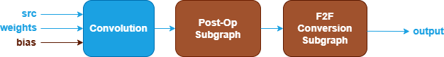
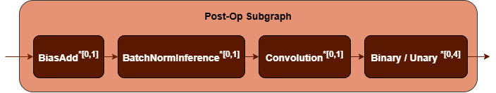
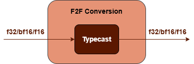
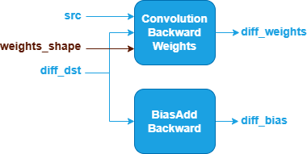

Convolution Fusion Patterns {#dev_guide_graph_convolution_fusion_patterns}
===========================================================

## Overview

oneDNN supports both floating-point and quantized Convolution fusion patterns to
optimize performance and reduce memory bandwidth requirements. This document
describes the supported floating-point fusion patterns for Convolution. For quantized
Convolution fusion patterns, refer to
[Quantized Convolution Fusion Patterns](@ref dev_guide_graph_quantized_convolution_fusion_patterns)
for more details.

## Pattern Structure
### Pattern Structure for Inference

oneDNN defines floating-point Convolution fusion patterns for inference as follows.
The blue nodes are required when defining a Convolution fusion pattern while the
brown nodes are optional.

1. **Convolution Operation**: Performs convolution between the `src` and
   `weights` tensors. The `bias` tensor is optional. See the
   [Convolution](@ref dev_guide_op_convolution) operation in the Graph API
   for more details.
2. **Post-Op Subgraph**: Optional and can include the following operations:
   - [BiasAdd](@ref dev_guide_op_biasadd) operation.
   - [BatchNormInference](@ref dev_guide_op_batchnorminference) operation.
   - [Convolution](@ref dev_guide_op_convolution) operation.
   - Binary and Unary operations: refer to the Note in
     [Fusion Patterns](graph_fusion_patterns.html).

   Combination Rules:

   

   - **BiasAdd**: If present, must be the first post-op and can only appear
     once.
   - **BatchNormInference**: If present, must precede Binary or Unary operations
     and can only appear once.
   - **Convolution**: If present, is a Depthwise Convolution which can only be
     fused with 1x1 Convolution and can only appear once.
   - 0 to 4 Binary or Unary operations are supported in the post-op subgraph.

3. **F2F Conversion Subgraph**: Converts `output` tensor from floating-point to
   another floating-point. It is constructed by a [TypeCast](@ref dev_guide_op_typecast)
   operation.

   

### Pattern Structure for Training

oneDNN defines floating-point Convolution fusion patterns for training as follows.
The blue nodes are required when defining a Convolution fusion pattern while the
brown nodes are optional.

1. **ConvolutionBackwardWeights operation**: Accepts `src`, `diff_dst` and
   optional `weights_shape` as inputs, and computes the gradients for weights.
   See the [ConvolutionBackwardWeights](@ref dev_guide_op_convolutionbackwardweights)
   operation in the Graph API for more
   details.
2. **BiasAddBackward Operation**: Computes the gradients for bias based on
   `diff_dst`. See the [BiasAddBackward](@ref dev_guide_op_biasaddbackward)
   operation in the Graph API for more details.
3. The two operations share the same input of `diff_dst`.

## Data Types

oneDNN supports the following combinations of data types for src, weights, bias
and output:

| src          | weights       | bias         | output       |
| :----------- | :------------ | :----------- | :----------- |
| f32,bf16,f16 | f32,bf16,f16  | f32,bf16,f16 | f32,bf16,f16 |

The definition of the data types and support status on different CPU and GPU
platforms follow the general description in the [Data Types Guide](@ref dev_guide_data_types).

## Implementation Limitations

1. Convolution as a post op (Depthwise Convolution) is not supported on GPU.
2. Convolution and BatchNormInference cannot co-exist in the post-op subgraph.
3. F2F Conversion Subgraph used for `output` tensor in inference only supports
   bf16 to f32 data type conversion.

## Example

oneDNN provides a [CPU Convolution
example](https://github.com/oneapi-src/oneDNN/tree/main/examples/graph/cpu_getting_started.cpp)
and a [GPU Convolution example](https://github.com/oneapi-src/oneDNN/tree/main/examples/graph/sycl_getting_started.cpp)
demonstrating how to construct a typical floating-point Convolution pattern for
inference with oneDNN Graph API on CPU and GPU.
