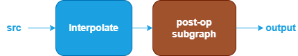

Interpolate Fusions {#dev_guide_graph_interpolate_fusions}
===========================================================

## Overview

oneDNN supports various Interpolate fusion patterns to optimize performance and
reduce memory bandwidth requirements. This document describes the supported
fusion patterns for Interpolate.

## Interpolate patterns

oneDNN supports Interpolate and its optimization through Graph API [1] by
defining the graph, getting partition from the graph, and optimizing the kernels
underneath. In general, a Interpolate pattern is defined as a directional acyclic
graph (DAG) using oneDNN Graph API.

### Floating-point Interpolate patterns

oneDNN defines floating-point (f32, bf16, or f16) Interpolate patterns as follows.
The blue parts are required when defining a Interpolate pattern while the brown
parts are optional.

1. The Interpolate performs corresponding Interpolate operation for src tensor.
   See [ReduceL1](@ref dev_guide_op_reducel1), [ReduceL2](@ref dev_guide_op_reducel2),
   [ReduceMax](@ref dev_guide_op_reducemax), [ReduceMean](@ref dev_guide_op_reducemean),
   [ReduceMin](@ref dev_guide_op_reducemin), [ReduceProd](@ref dev_guide_op_reduceprod),
   [ReduceSum](@ref dev_guide_op_reducesum) in Graph API.
2. The post-op subgraph is optional and can be constructed with the following operations:
   1. Binary operations: [Add](@ref dev_guide_op_add),
      [Subtract](@ref dev_guide_op_subtract), [Maximum](@ref dev_guide_op_maximum),
      [Minimum](@ref dev_guide_op_minimum), [Multiply](@ref dev_guide_op_multiply),
      [Divide](@ref dev_guide_op_divide).
   2. Unary operations: [Abs](@ref dev_guide_op_abs),
      [Clamp](@ref dev_guide_op_clamp), [Elu](@ref dev_guide_op_elu),
      [Exp](@ref dev_guide_op_exp), [GELU](@ref dev_guide_op_gelu),
      [HardSigmoid](@ref dev_guide_op_hardsigmoid), [HardSwish](@ref dev_guide_op_hardswish),
      [LeakyReLU](@ref dev_guide_op_leakyrelu), [Log](@ref dev_guide_op_log),
      [Mish](@ref dev_guide_op_mish), [Sigmoid](@ref dev_guide_op_sigmoid),
      [SoftPlus](@ref dev_guide_op_softplus), [ReLU](@ref dev_guide_op_relu),
      [Round](@ref dev_guide_op_round), [Sqrt](@ref dev_guide_op_sqrt),
      [Square](@ref dev_guide_op_square), [Tanh](@ref dev_guide_op_tanh).

   Combination rules:

   1. 1 to 4 Interpolate/unary operations are supported.

## Data Types

oneDNN supports the floating-point Interpolate pattern with data types f32,
bf16, and f16. You can specify the data type via the input and output logical
tensors' data type fields for each operation. oneDNN supports limited mix-precision
in a floating-point Interpolate pattern.

The definition of the data types and support status on different CPU and GPU
platforms follow the general description in @ref dev_guide_data_types.

## Implementation limitations

1. The patterns only support Interpolate with half_pixel coordinate_transformation_mode.

## References

[1] oneDNN Graph API documentation, https://oneapi-src.github.io/oneDNN/graph_extension.html
