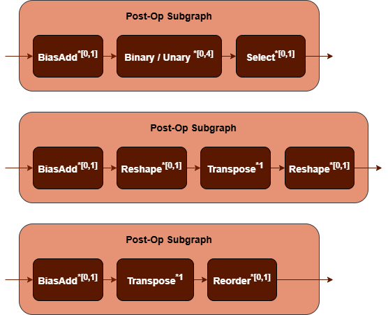

MatMul Fusion Patterns {#dev_guide_graph_matmul_fusion_patterns}
===========================================================

## Overview

oneDNN supports both floating-point and quantized MatMul fusion patterns to
optimize performance and reduce memory bandwidth requirements. This document
describes the supported floating-point fusion patterns for MatMul. For quantized
MatMul fusion patterns, refer to [Quantized MatMul Fusion Patterns](@ref dev_guide_graph_quantized_matmul_fusion_patterns)
for more details.

## Pattern Structure

oneDNN defines floating-point MatMul fusion patterns as follows.
The blue nodes are required when defining a MatMul fusion pattern while the brown
parts are optional.

1. **MatMul Operation**: Performs matrix multiplication between the `src` and
   `weights` tensors. The `bias` tensor is optional. See the [MatMul](@ref dev_guide_op_matmul)
   operation in the Graph API for more details.
2. **Post-Op Subgraph**: Optional and can include the following operations:
   - [BiasAdd](@ref dev_guide_op_biasadd) operation.
   - Binary and Unary operations: refer to the Note in
     [Fusion Patterns](graph_fusion_patterns.html).
   - [Select](@ref dev_guide_op_select) operation.
   - **Data Manipulation Operations**: [StaticTranspose](@ref dev_guide_op_statictranspose),
     [StaticReshape](@ref dev_guide_op_staticreshape), [Reorder](@ref dev_guide_op_reorder).

   Combination Rules:

   

   - **BiasAdd**: If present, must be the first post-op and can only appear once.
   - 0 to 4 Binary or Unary operations are supported in the post-op subgraph.
   - **Select**: If present, must follow binary/unary operations (if present)
     and can only appear once.
   - **Reshape**: If present, must precede or follow the Transpose operation.
   - **Reorder**: If present, must follow the Transpose operation.

## Data Types

oneDNN supports the following combinations of data types for src, weights, bias
and output:

| src          | weights       | bias         | output       |
| :----------- | :------------ | :----------- | :----------- |
| f32,bf16,f16 | f32,bf16,f16  | f32,bf16,f16 | f32,bf16,f16 |

The definition of the data types and support status on different CPU and GPU
platforms follow the general description in the [Data Types Guide](@ref dev_guide_data_types).

## Example

oneDNN provides examples demonstrating how to construct a typical floating-point
MatMul pattern with the oneDNN Graph API on both CPU and GPU:

- [CPU MatMul Example](https://github.com/oneapi-src/oneDNN/tree/main/examples/graph/cpu_simple_op_partition.cpp)
- [GPU MatMul Example](https://github.com/oneapi-src/oneDNN/tree/main/examples/graph/sycl_simple_op_partition.cpp)
