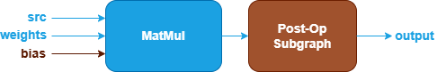

MatMul Fusion Patterns {#dev_guide_graph_matmul_fusion_patterns}
===========================================================

## Overview

oneDNN supports both floating-point and quantized MatMul fusion patterns to
optimize performance and reduce memory bandwidth requirements. This document
describes the supported floating-point fusion patterns for MatMul. For quantized
MatMul fusion patterns, refer to [Quantized MatMul Fusion Patterns](@ref
dev_guide_graph_quantized_matmul_fusion_patterns) for more details.

## Pattern Structure

oneDNN defines floating-point MatMul fusion patterns as follows.
The blue parts are required when defining a MatMul fusion pattern while the brown
parts are optional.

1. **MatMul Operation**: Performs matrix multiplication between the `src` and
   `weights` tensors. The `bias` tensor is optional. See the [MatMul](@ref
   dev_guide_op_matmul) operation in the Graph API for more details.
2. **Post-Op Subgraph**: Optional and can include the following operations:
   - [BiasAdd](@ref dev_guide_op_biasadd) operation.
   - **Binary Operations**: [Add](@ref dev_guide_op_add),
     [Subtract](@ref dev_guide_op_subtract), [Maximum](@ref dev_guide_op_maximum),
     [Minimum](@ref dev_guide_op_minimum), [Multiply](@ref dev_guide_op_multiply),
     [Divide](@ref dev_guide_op_divide).
   - **Unary Operations**: [Abs](@ref dev_guide_op_abs),
     [Clamp](@ref dev_guide_op_clamp), [Elu](@ref dev_guide_op_elu),
     [Exp](@ref dev_guide_op_exp), [GELU](@ref dev_guide_op_gelu),
     [HardSigmoid](@ref dev_guide_op_hardsigmoid), [HardSwish](@ref dev_guide_op_hardswish),
     [LeakyReLU](@ref dev_guide_op_leakyrelu), [Log](@ref dev_guide_op_log),
     [Mish](@ref dev_guide_op_mish), [Sigmoid](@ref dev_guide_op_sigmoid),
     [SoftPlus](@ref dev_guide_op_softplus), [ReLU](@ref dev_guide_op_relu),
     [Round](@ref dev_guide_op_round), [Sqrt](@ref dev_guide_op_sqrt),
     [Square](@ref dev_guide_op_square), [Tanh](@ref dev_guide_op_tanh).
   - [Select](@ref dev_guide_op_select) operation.
   - **Data Manipulation Operations**: [StaticTranspose](@ref dev_guide_op_statictranspose),
     [StaticReshape](@ref dev_guide_op_staticreshape), [Reorder](@ref dev_guide_op_reorder).

   Combination Rules:

   - 1 to 4 binary/unary operations are supported in the post-op subgraph.
   - **BiasAdd**: If present, must be the first post-op and can only appear once.
   - **Select**: If present, must precede binary/unary operations (if present)
     and can only appear once.
   - **Reshape**: If present, must precede or follow the Transpose operation.
   - **Reorder**: If present, must follow the Transpose operation.

## Data Types

oneDNN supports floating-point MatMul patterns with data types `f32`, `bf16`,
and `f16`. You can specify the data type via the input and output logical
tensors' data type fields for each operation. oneDNN also supports limited
mixed-precision in floating-point MatMul patterns.

The definition of data types and their support status on different CPU and GPU
platforms follow the general description in the [Data Types Guide](@ref
dev_guide_data_types).

## Example

oneDNN provides examples demonstrating how to construct a typical floating-point
MatMul pattern with the oneDNN Graph API on both CPU and GPU:

- [CPU MatMul Example](https://github.com/oneapi-src/oneDNN/tree/main/examples/graph/cpu_simple_op_partition.cpp)
- [GPU MatMul Example](https://github.com/oneapi-src/oneDNN/tree/main/examples/graph/sycl_simple_op_partition.cpp)
