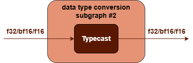
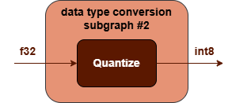

Norm Fusions {#dev_guide_graph_norm_fusions}
===========================================================

## Overview

oneDNN supports various Norm fusion patterns to optimize performance and
reduce memory bandwidth requirements. This document describes the supported
fusion patterns for Norm.

## Norm patterns

The Norm category for inference includes operations such as:
[GroupNorm](@ref dev_guide_op_groupnorm), [LayerNorm](@ref dev_guide_op_layernorm),
[BatchNormInference](@ref dev_guide_batch_normalization).

oneDNN supports Norm and its optimization through Graph API [1] by
defining the graph, getting partition from the graph, and optimizing the kernels
underneath. In general, a Norm pattern is defined as a directional acyclic
graph (DAG) using oneDNN Graph API.

oneDNN defines Norm patterns as follows.
The blue parts are required when defining a Norm pattern while the brown
parts are optional.

1. The Norm performs corresponding norm operation for src tensor.
   See [GroupNorm](@ref dev_guide_op_groupnorm), [LayerNorm](@ref dev_guide_op_layernorm),
   [BatchNormInference](@ref dev_guide_batch_normalization) in Graph API.
2. The first data type conversion subgraph #2 is optional and is used to convert
   output tensor from one floating-point to another. See
   [TypeCast](@ref dev_guide_op_typecast) operations in Graph API.

   

3. The post-op subgraph is optional and can be constructed with the following operations:
   1. Binary operations: [Add](@ref dev_guide_op_add),
      [Subtract](@ref dev_guide_op_subtract), [Maximum](@ref dev_guide_op_maximum),
      [Minimum](@ref dev_guide_op_minimum), [Multiply](@ref dev_guide_op_multiply),
      [Divide](@ref dev_guide_op_divide).
   2. Unary operations: [Abs](@ref dev_guide_op_abs),
      [Clamp](@ref dev_guide_op_clamp), [Elu](@ref dev_guide_op_elu),
      [Exp](@ref dev_guide_op_exp), [GELU](@ref dev_guide_op_gelu),
      [HardSigmoid](@ref dev_guide_op_hardsigmoid), [HardSwish](@ref dev_guide_op_hardswish),
      [LeakyReLU](@ref dev_guide_op_leakyrelu), [Log](@ref dev_guide_op_log),
      [Mish](@ref dev_guide_op_mish), [Sigmoid](@ref dev_guide_op_sigmoid),
      [SoftPlus](@ref dev_guide_op_softplus), [ReLU](@ref dev_guide_op_relu),
      [Round](@ref dev_guide_op_round), [Sqrt](@ref dev_guide_op_sqrt),
      [Square](@ref dev_guide_op_square), [Tanh](@ref dev_guide_op_tanh).
4. The second data type conversion subgraph #2 is optional and is used to convert
   output tensor from floating-point to quantized data type. See
   [Quantize](@ref dev_guide_op_quantize) operations in Graph API.

   

Combination rules:

1. 1 to 4 binary/unary operations are supported.

## Data Types

oneDNN supports the following combinations of data types for src and output:

| src           | output             |
| :------------ | :----------------- |
| bf16,f16,f32  | u8,s8,bf16,f16,f32 |

The definition of the data types and support status on different CPU and GPU
platforms follow the general description in @ref dev_guide_data_types.

You can specify the data type via the input and output logical
tensors' data type fields for each operation.

## Implementation limitations

1. BatchNormInference:
   1. The post-op subgraph only supports ReLU.
   2. Data type conversion subgraphs are not supported.

## References

[1] oneDNN Graph API documentation, https://oneapi-src.github.io/oneDNN/graph_extension.html
