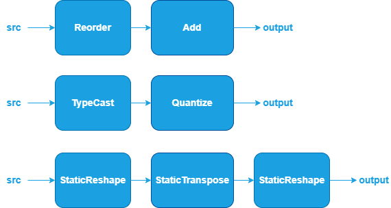

Other Fusions {#dev_guide_graph_other_fusions}
===========================================================

## Overview

oneDNN supports some specialized fusion patterns to optimize performance and
reduce memory bandwidth requirements.

## Other patterns

The Other category currently includes operations such as:
[Reorder](@ref dev_guide_op_reorder), [TypeCast](@ref dev_guide_op_typecast),
[Quantize](@ref dev_guide_op_quantize),
[StaticReshape](@ref dev_guide_op_staticreshape) and
[StaticTranspose](@ref dev_guide_op_statictranspose).

oneDNN supports these optimization through Graph API [1] by
defining the graph, getting partition from the graph, and optimizing the kernels
underneath. In general, a Norm pattern is defined as a directional acyclic
graph (DAG) using oneDNN Graph API.

## References

[1] oneDNN Graph API documentation, https://oneapi-src.github.io/oneDNN/graph_extension.html
