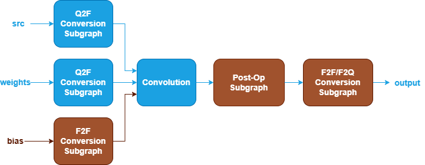
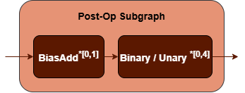

Quantized Convolution Fusion Patterns {#dev_guide_graph_quantized_convolution_fusion_patterns}
===========================================================

## Overview

oneDNN supports both floating-point and quantized Convolution fusion patterns to
optimize performance and reduce memory bandwidth requirements. This document
describes the supported quantized fusion patterns for Convolution. For floating-point
Convolution fusion patterns, refer to
[Convolution Fusion Patterns](@ref dev_guide_graph_convolution_fusion_patterns)
for more details.

## Pattern Structure

oneDNN defines quantized Convolution fusion patterns as follows.
The blue parts are required when defining a Convolution fusion pattern while the brown
parts are optional.

1. **Q2F Conversion Subgraph**: Converts `src` and `weights` tensors
   from quantized to floating-point. It can be one of the following
   subgraphs, while the last two subgraphs apply only to `weights`.
   See [Dequantize](@ref dev_guide_op_dequantize), [TypeCast](@ref dev_guide_op_typecast)
   and [Quantize](@ref dev_guide_op_quantize)
   operations in Graph API.

   
   
    

2. **F2F Conversion Subgraph**: Converts `bias` tensor from floating-point to
   another floating-point. It is constructed by a [TypeCast](@ref dev_guide_op_typecast)
   operation.

   

3. **Convolution Operation**: Performs convolution between the `src` and
   `weights` tensors. The `bias` tensor is optional. See the [Convolution](@ref dev_guide_op_convolution)
   operation in the Graph API for more details.
4. **Post-Op Subgraph**: Optional and can include the following operations:
   - [BiasAdd](@ref dev_guide_op_biasadd) operation.
   - Binary and Unary operations: refer to the Note in
     [Fusion Patterns](graph_fusion_patterns.html).

   Combination Rules:

   

   - **BiasAdd**: If present, must be the first post-op and can only appear
     once.
   - 0 to 4 Binary or Unary operations are supported in the post-op subgraph.

5. **F2F/F2Q Conversion Subgraph**: Converts the output
   tensor from floating-point to floating-point or quantized data type. It can
   be one of the following subgraphs. See [TypeCast](@ref dev_guide_op_typecast)
   and [Quantize](@ref dev_guide_op_quantize) operations in Graph API.

   
    

## Data Types

oneDNN supports the following combinations of data types for src, weights, bias
and output:

| src   | weights | bias         | output             |
| :---- | :------ | :----------- | :----------------- |
| u8,s8 | s8,f32  | f32,bf16,f16 | u8,s8,bf16,f16,f32 |

The definition of the data types and support status on different CPU and GPU
platforms follow the general description in the [Data Types Guide](@ref dev_guide_data_types).

## Implementation Limitations

1. F2Q Conversion Subgraph used for `output` tensor only supports
   bf16 to f32 data type conversion.

## Example

oneDNN provides a [quantized Convolution
example](https://github.com/oneapi-src/oneDNN/tree/main/examples/graph/cpu_inference_int8.cpp)
demonstrating how to construct a typical quantized Convolution pattern with oneDNN
Graph API on CPU.
