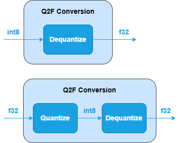
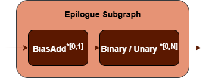

Quantized ConvTranspose Fusion Patterns {#dev_guide_graph_quantized_convtranspose_fusion_patterns}
==================================================================================================

## Overview

oneDNN supports both floating-point and quantized ConvTranspose fusion patterns to
optimize performance and reduce memory bandwidth requirements. This document
describes the supported quantized fusion patterns for ConvTranspose. For floating-point
ConvTranspose fusion patterns, refer to [ConvTranspose Fusion Patterns](@ref dev_guide_graph_convtranspose_fusion_patterns)
for more details.

## Pattern Structure

oneDNN defines quantized ConvTranspose fusion patterns as follows.
The blue nodes are required when defining a quantized ConvTranspose fusion
pattern while the brown nodes are optional.

1. **Q2F Conversion Subgraph**: Converts `src` and `weights` tensors
   from quantized to floating-point. It can be one of the following
   subgraphs, while the second subgraph applies only to `weights`.
   See [Dequantize](@ref dev_guide_op_dequantize) and [Quantize](@ref dev_guide_op_quantize)
   operations in Graph API.

   

2. **ConvTranspose Operation**: Performs transposed convolution between the
   `src` and `weights` tensors. The `bias` tensor is optional. See the
   [ConvTranspose](@ref dev_guide_op_convtranspose) operation in the Graph API
   for more details.
3. **Epilogue Subgraph**: Optional and can include the following operations:
   - [BiasAdd](@ref dev_guide_op_biasadd) operation.
   - Binary and Unary operations: refer to the Note in
     [Fusion Patterns](graph_fusion_patterns.html).

   Combination Rules:

   

   - **BiasAdd**: If present, must be the first op in the epilogue subgraph and
     can only appear once.
   - 0 to 4 Binary or Unary operations are supported in the epilogue subgraph.

4. **F2Q Conversion Subgraph**: Converts the output tensor from floating-point
   to quantized data type. It is constructed by a [Quantize](@ref dev_guide_op_quantize)
   operation.

   

## Data Types

oneDNN supports the following combinations of data types for src, weights, bias
and dst:

| src   | weights | bias         | dst                |
| :---- | :------ | :----------- | :----------------- |
| u8,s8 | s8,f32  | f32,bf16,f16 | u8,s8,bf16,f16,f32 |

The definition of the data types and support status on different CPU and GPU
platforms follow the general description in the [Data Types Guide](@ref dev_guide_data_types).

## Implementation Limitations

1. GPU
   - Dequantize and Quantize in Q2F and F2Q Conversion Subgraphs only support zps
     values as all zeros.
   - Quantize in F2Q Conversion Subgraph only supports per_tensor quantization
     type, and its scales values should be all ones.
