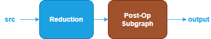

Reduction Fusion Patterns {#dev_guide_graph_reduction_fusion_patterns}
===========================================================

## Overview

The Reduction category includes operations such as: ReduceL1, ReduceL2,
ReduceMax, ReduceMean, ReduceMin, ReduceProd, ReduceSum.

oneDNN supports various reduction fusion patterns to optimize performance and
reduce memory bandwidth requirements. This document describes the supported
fusion patterns for Reduction.

## Pattern Structure

oneDNN defines floating-point Reduction fusion patterns as follows.
The blue parts are required when defining a Reduction fusion pattern while the
brown parts are optional.

1. **Reduction Operation**: Performs the corresponding reduction operation for the
   `src` tensor. See the [ReduceL1](@ref dev_guide_op_reducel1),
   [ReduceL2](@ref dev_guide_op_reducel2), [ReduceMax](@ref dev_guide_op_reducemax),
   [ReduceMean](@ref dev_guide_op_reducemean), [ReduceMin](@ref dev_guide_op_reducemin),
   [ReduceProd](@ref dev_guide_op_reduceprod) and
   [ReduceSum](@ref dev_guide_op_reducesum) operations in the Graph API for more
   details.
2. **Post-Op Subgraph**: Optional and can include the following operations:
   - **Binary Operations**: [Add](@ref dev_guide_op_add),
      [Subtract](@ref dev_guide_op_subtract), [Maximum](@ref dev_guide_op_maximum),
      [Minimum](@ref dev_guide_op_minimum), [Multiply](@ref dev_guide_op_multiply),
      [Divide](@ref dev_guide_op_divide).
   - **Unary Operations**: [Abs](@ref dev_guide_op_abs),
     [Clamp](@ref dev_guide_op_clamp), [Elu](@ref dev_guide_op_elu),
     [Exp](@ref dev_guide_op_exp), [GELU](@ref dev_guide_op_gelu),
     [HardSigmoid](@ref dev_guide_op_hardsigmoid), [HardSwish](@ref dev_guide_op_hardswish),
     [LeakyReLU](@ref dev_guide_op_leakyrelu), [Log](@ref dev_guide_op_log),
     [Mish](@ref dev_guide_op_mish), [Sigmoid](@ref dev_guide_op_sigmoid),
     [SoftPlus](@ref dev_guide_op_softplus), [ReLU](@ref dev_guide_op_relu),
     [Round](@ref dev_guide_op_round), [Sqrt](@ref dev_guide_op_sqrt),
     [Square](@ref dev_guide_op_square), [Tanh](@ref dev_guide_op_tanh).

   Combination Rules:

   - 1 to 4 binary/unary operations are supported in the post-op subgraph.

## Data Types

oneDNN supports Interpolate fusion patterns with data types `f32`, `bf16`,
and `f16`. You can specify the data type via the input and output logical
tensors' data type fields for each operation.

The definition of data types and their support status on different CPU and GPU
platforms follow the general description in the [Data Types Guide](@ref
dev_guide_data_types).
