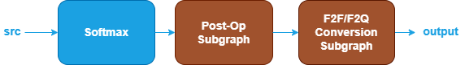
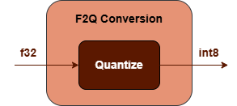
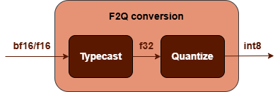

Softmax Fusion Patterns {#dev_guide_graph_softmax_fusion_patterns}
===========================================================

## Overview

oneDNN supports various SoftMax fusion patterns to optimize performance and
reduce memory bandwidth requirements. This document describes the supported
fusion patterns for SoftMax.

## Pattern Structure

oneDNN defines floating-point SoftMax fusion patterns as follows.
The blue parts are required when defining a SoftMax fusion pattern while the
brown parts are optional.

1. **SoftMax Operation**: Performs the softmax function for the `src` tensor. See
   the [SoftMax](@ref dev_guide_op_softmax) operation in the Graph API for more details.
2. **Post-Op Subgraph**: Optional and can include the following operations:
   - **Binary Operations**: [Add](@ref dev_guide_op_add),
      [Subtract](@ref dev_guide_op_subtract), [Maximum](@ref dev_guide_op_maximum),
      [Minimum](@ref dev_guide_op_minimum), [Multiply](@ref dev_guide_op_multiply),
      [Divide](@ref dev_guide_op_divide).
   - **Unary Operations**: [Abs](@ref dev_guide_op_abs),
     [Clamp](@ref dev_guide_op_clamp), [Elu](@ref dev_guide_op_elu),
     [Exp](@ref dev_guide_op_exp), [GELU](@ref dev_guide_op_gelu),
     [HardSigmoid](@ref dev_guide_op_hardsigmoid), [HardSwish](@ref dev_guide_op_hardswish),
     [LeakyReLU](@ref dev_guide_op_leakyrelu), [Log](@ref dev_guide_op_log),
     [Mish](@ref dev_guide_op_mish), [Sigmoid](@ref dev_guide_op_sigmoid),
     [SoftPlus](@ref dev_guide_op_softplus), [ReLU](@ref dev_guide_op_relu),
     [Round](@ref dev_guide_op_round), [Sqrt](@ref dev_guide_op_sqrt),
     [Square](@ref dev_guide_op_square), [Tanh](@ref dev_guide_op_tanh).

   Combination Rules:

   - 1 to 4 binary/unary operations are supported in the post-op subgraph.

3. **F2F/F2Q Conversion Subgraph**: Converts the output
   tensor from floating-point to floating-point or quantized data type. It can
   be one of the following subgraphs. See [TypeCast](@ref dev_guide_op_typecast)
   and [Quantize](@ref dev_guide_op_quantize) operations in Graph API.

   
    

## Data Types

oneDNN supports the following combinations of data types for src and output:

| src           | output             |
| :------------ | :----------------- |
| bf16,f16,f32  | u8,s8,bf16,f16,f32 |

The definition of data types and their support status on different CPU and GPU
platforms follow the general description in the [Data Types Guide](@ref
dev_guide_data_types).
