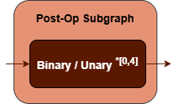

Unary Fusion Patterns {#dev_guide_graph_unary_fusion_patterns}
===========================================================

## Overview

oneDNN supports various unary fusion patterns to optimize performance and
reduce memory bandwidth requirements. This document describes the supported
fusion patterns for Unary operations.

## Pattern Structure

oneDNN defines floating-point Unary fusion patterns as follows.
The blue parts are required when defining a Unary fusion pattern while the
brown parts are optional.

1. **Unary Operation**: Performs the corresponding unary operation for the
   `src` tensor. Refer to the Note in
   [Fusion Patterns](graph_fusion_patterns.html).
2. **Post-Op Subgraph**: Optional and can include the following operations:
   - Unary operations.
   - Binary operations: refer to the Note in
     [Fusion Patterns](graph_fusion_patterns.html).

   Combination Rules:

   

   - 0 to 4 Binary or Unary operations are supported in the post-op subgraph.

## Data Types

oneDNN supports Unary fusion patterns with data types `f32`, `bf16`,
and `f16`. You can specify the data type via the input and output logical
tensors' data type fields for each operation.

The definition of data types and their support status on different CPU and GPU
platforms follow the general description in the [Data Types Guide](@ref dev_guide_data_types).
