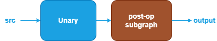

Unary Fusions {#dev_guide_graph_unary_fusions}
===========================================================

## Overview

The Unary category includes operations such as: [Abs](@ref dev_guide_op_abs),
[Clamp](@ref dev_guide_op_clamp), [Elu](@ref dev_guide_op_elu),
[Exp](@ref dev_guide_op_exp), [GELU](@ref dev_guide_op_gelu),
[HardSigmoid](@ref dev_guide_op_hardsigmoid), [HardSwish](@ref dev_guide_op_hardswish),
[LeakyReLU](@ref dev_guide_op_leakyrelu), [Log](@ref dev_guide_op_log),
[Mish](@ref dev_guide_op_mish), [Sigmoid](@ref dev_guide_op_sigmoid),
[SoftPlus](@ref dev_guide_op_softplus), [ReLU](@ref dev_guide_op_relu),
[Round](@ref dev_guide_op_round), [Sqrt](@ref dev_guide_op_sqrt),
[Square](@ref dev_guide_op_square), [Tanh](@ref dev_guide_op_tanh).

oneDNN supports various Unary fusion patterns to optimize performance and
reduce memory bandwidth requirements. This document describes the supported
fusion patterns for Unary.

## Unary patterns

oneDNN supports Unary and its optimization through Graph API [1] by
defining the graph, getting partition from the graph, and optimizing the kernels
underneath. In general, a Unary pattern is defined as a directional acyclic
graph (DAG) using oneDNN Graph API.

### Floating-point Unary patterns

oneDNN defines floating-point (f32, bf16, or f16) Unary patterns as follows.
The blue parts are required when defining a Unary pattern while the brown
parts are optional.

1. The Unary performs corresponding Unary operation on src tensor.
   See [Abs](@ref dev_guide_op_abs),
   [Clamp](@ref dev_guide_op_clamp), [Elu](@ref dev_guide_op_elu),
   [Exp](@ref dev_guide_op_exp), [GELU](@ref dev_guide_op_gelu),
   [HardSigmoid](@ref dev_guide_op_hardsigmoid), [HardSwish](@ref dev_guide_op_hardswish),
   [LeakyReLU](@ref dev_guide_op_leakyrelu), [Log](@ref dev_guide_op_log),
   [Mish](@ref dev_guide_op_mish), [Sigmoid](@ref dev_guide_op_sigmoid),
   [SoftPlus](@ref dev_guide_op_softplus), [ReLU](@ref dev_guide_op_relu),
   [Round](@ref dev_guide_op_round), [Sqrt](@ref dev_guide_op_sqrt),
   [Square](@ref dev_guide_op_square), [Tanh](@ref dev_guide_op_tanh) in Graph API.
1. The post-op subgraph is optional and can be constructed with the following operations:
   1. Unary operation.
   2. Binary operations: [Add](@ref dev_guide_op_add),
      [Subtract](@ref dev_guide_op_subtract), [Maximum](@ref dev_guide_op_maximum),
      [Minimum](@ref dev_guide_op_minimum), [Multiply](@ref dev_guide_op_multiply)
      and [Divide](@ref dev_guide_op_divide).

   Combination rules:

   3. 1 to 4 Unary/unary operations are supported.

## Data Types

oneDNN supports the floating-point Unary pattern with data types f32,
bf16, and f16. You can specify the data type via the input and output logical
tensors' data type fields for each operation. oneDNN supports limited mix-precision
in a floating-point Unary pattern.

The definition of the data types and support status on different CPU and GPU
platforms follow the general description in @ref dev_guide_data_types.

## References

[1] oneDNN Graph API documentation, https://oneapi-src.github.io/oneDNN/graph_extension.html
