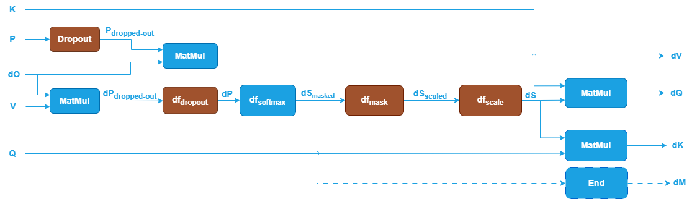
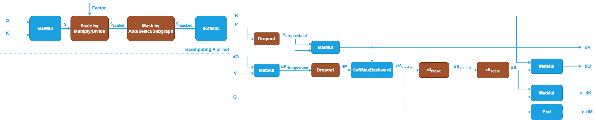
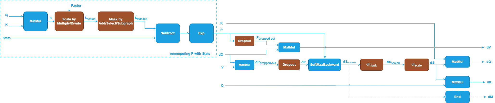
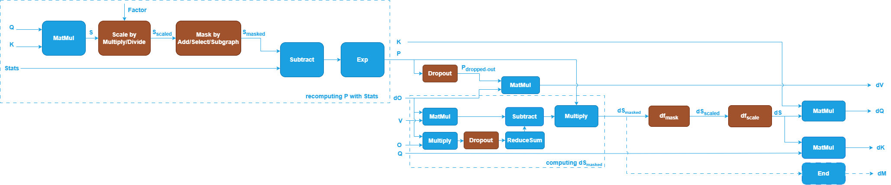

# Supporting SDPA Training in Graph API

## Background

Scaled Dot-Product Attention (SDPA), introduced in [1], is a fundamental
operation in Transformer blocks and serves as the backbone for numerous language
and generative models (e.g., BERT, Stable Diffusion, GPT, DeepSeek).

oneDNN supports SDPA inference and its optimization through the Graph API by
defining an SDPA graph, partitioning it, and optimizing the underlying kernels.
The floating-point SDPA — supporting `f32`, `bf16`, or `f16` — is defined as
shown below:

The blue nodes are required when defining an SDPA pattern, while the brown nodes
are optional. The general pattern computes `MatMul-SoftMax-MatMul`, as
illustrated by the blue nodes. Given input sequences $Q$, $K$, and $V$:

> $$
> Q \in \mathbb{R}^{B \times H_{q} \times S_{q} \times D_{qk}}
> $$
> $$
> K \in \mathbb{R}^{B \times H_{k} \times S_{kv} \times D_{qk}}
> $$
> $$
> V \in \mathbb{R}^{B \times H_{v} \times S_{kv} \times D_{v}}
> $$

where:

- $B$: Batch size
- $H_{q}$: Number of query heads
- $H_{k}$: Number of key heads
- $H_{v}$: Number of value heads
- $S_{q}$: Sequence length of the query
- $S_{kv}$: Sequence length of the key and value
- $D_{qk}$: Embedding dimension per head of query and key
- $D_{v}$: Embedding dimension per head of value

The attention output $O$ is computed as:

> $$
> S = Q \cdot K^T \in \mathbb{R}^{B \times H_{q} \times S_{q} \times S_{kv}}
> $$
> $$
> P = f_{softmax}(S) \in \mathbb{R}^{B \times H_{q} \times S_{q} \times S_{kv}}
> $$
> $$
> O = P \cdot V \in \mathbb{R}^{B \times H_{q} \times S_{q} \times D_{v}}
> $$

The standard implementation materializes the matrices $S$ and $P$ in
high-bandwidth memory (HBM), which requires $O(S^2)$ memory. This becomes
challenging for long sequence scenarios. To address this, oneDNN supports the
FlashAttention 2 algorithm [2], while the reference implementation still follows
the standard approach.

For additional opt-in features, such as attention scaling and masking, the
computations are adjusted accordingly:

> $$
> S_{scaled} = f_{scale}(S) \in \mathbb{R}^{B \times H_{q} \times S_{q} \times S_{kv}}
> $$
> $$
> S_{masked} = f_{mask}(S_{scaled}) \in \mathbb{R}^{B \times H_{q} \times S_{q} \times S_{kv}}
> $$

The following sections explore how to support SDPA training in the oneDNN Graph
API. We will start from `f32` data type.

## SDPA Training Basics

### Standard SDPA Training Forward Propagation

The forward propagation for SDPA training follows the same mathematical
representation as inference, with the following differences:

1. Dropout may be applied after the SoftMax operation and before the second
   MatMul:

> $$
> P_{dropped-out} = f_{dropout}(P) \in \mathbb{R}^{B \times H_{q} \times S_{q} \times S_{kv}}
> $$
> $$
> O = P_{dropped-out} \cdot V \in \mathbb{R}^{B \times H_{q} \times S_{q} \times D_{v}}
> $$

2. Additional outputs, e.g. SoftMax Stats, may be required to save intermediate
   results for backward propagation.

These aspects will be discussed in detail in the following sections.

### Standard SDPA Training Backward Propagation

Given the gradient of the output $dO$, the gradients for the query, key, and
value tensors ($dQ$, $dK$, $dV$) are computed as follows:

> $$
> dV = P^T \cdot dO \in \mathbb{R}^{B \times H_{v} \times S_{kv} \times D_{v}}
> $$
> $$
> dP = dO \cdot V^T \in \mathbb{R}^{B \times H_{q} \times S_{q} \times S_{kv}}
> $$
> $$
> dS = df_{softmax}(dP) \in \mathbb{R}^{B \times H_{q} \times S_{q} \times S_{kv}}
> $$
> $$
> dQ = dS \cdot K \in \mathbb{R}^{B \times H_{q} \times S_{q} \times D_{qk}}
> $$
> $$
> dK = Q \cdot dS^T \in \mathbb{R}^{B \times H_{k} \times S_{kv} \times D_{qk}}
> $$

#### Additional Steps for Opt-In Features

If opt-in features are enabled, additional steps are required to compute $dP$
and $dS$:
> $$
> dV = P_{dropped-out}^T \cdot dO \in \mathbb{R}^{B \times H_{v} \times S_{kv} \times D_{v}}
> $$
> $$
> dP_{dropped-out} = dO \cdot V^T \in \mathbb{R}^{B \times H_{q} \times S_{q} \times S_{kv}}
> $$
> $$
> dP = df_{dropout}(dP_{dropped-out}) \in \mathbb{R}^{B \times H_{q} \times S_{q} \times S_{kv}}
> $$
> $$
> dS_{masked} = df_{softmax}(dP) \in \mathbb{R}^{B \times H_{q} \times S_{q} \times S_{kv}}
> $$
> $$
> dS_{scaled} = df_{mask}(dS_{masked}) \in \mathbb{R}^{B \times H_{q} \times S_{q} \times S_{kv}}
> $$
> $$
> dS = df_{scale}(dS_{scaled}) \in \mathbb{R}^{B \times H_{q} \times S_{q} \times S_{kv}}
> $$

Where:

- $df_{scale}$ is a Multiply or Divide operation.
- $df_{mask}$ actually is an Identity operation that does nothing.

If explicit masks are present, an additional gradient output for the mask, $dM$,
is computed as:
> $$
> dM = dS_{masked} \in \mathbb{R}^{B \times H_{q} \times S_{q} \times S_{kv}}
> $$

Note $dS_{masked}$ is an intermediate tensor, if we want to define it as an output
tensor for the whole graph ($dM$), we need to explicitly mark it with an `End` operation.

## Support in Frameworks and Libraries

### cuDNN

#### SDPA Forward

cuDNN supports flash-fused attention to perform scaled dot-product attention.
The general pattern supported is `MatMul-Softmax-MatMul`, with optional features
such as scaling, masking, and dropout that users can opt into.

The SoftMax operation is decomposed into several pointwise and reduction
operations, as illustrated below:

This decomposition is based on the following formulas:

> $$
> max = \sum_{j=1}^{S_{kv}}{S_{:,:,:,j}} \in \mathbb{R}^{B \times H_{q} \times S_{q} \times 1}
> $$
> $$
> P_{:,:,:,i} = \frac{e^{S_{:,:,:,i} - max}}{\sum_{j=1}^{S_{kv}}{e^{S_{:,:,:,j} - max}}}
> $$
> $$
> Stats = max + \log_{e}\sum_{j=1}^{S_{kv}}{e^{S_{:,:,:,j} - max}} \in \mathbb{R}^{B \times H_{q} \times S_{q} \times 1}
> $$

Both $P$ and $Stats$ are outputs of the SoftMax operation. The $Stats$ are saved
and used during backward propagation to reconstruct $P$.
The primary reason SDPA forward keeps $Stats$ instead of $P$ is mainly to
optimize memory usage:

- Softmax Output ($P$): Storing the full softmax output requires significant
  memory, especially for long sequences, as it scales with the size of the
  attention matrix ($B \times H_{q} \times S_{q} \times S_{kv}$).
- Softmax Statistics ($Stats$): Storing only the statistics requires much less
  memory because it reduces the storage to a smaller tensor (e.g., $B \times
  H_{q} \times S_{q} \times 1$), which is independent of the sequence length
  $S_{kv}$.

By keeping the statistics instead of the full output, the memory footprint is
significantly reduced, which is critical for large-scale models and long
sequences. Additionally, according to FlashAttention [3], even though
recomputation introduces more FLOPs, it accelerates the backward pass by
reducing HBM accesses on GPUs like the A100.

For dropout, the cuDNN Graph API supports Philox-generated dropout. A Philox
random number generator (RNG) is used to create a random dropout mask, as
described in PyTorch [4]. This operation involves the following parameters:

- **RNG seed**: Seed for the random number generator.
- **RNG offset**: Describes how many 128-bit random numbers to skip.
- **Dropout probability**: A float representing the probability of setting a
  weight to zero.

Once the mask is generated by the RNG, two pointwise `Multiply` operations are
used to apply the mask and scale the output.

#### SDPA Backward

With the precomputed SoftMax $Stats$, the SoftMax output $P$ can be reconstructed as:

> $$
> P = e^{S - stats} \in \mathbb{R}^{B \times H_{q} \times S_{q} \times S_{kv}}
> $$

If Dropout is not considered, $dV$ can be computed as:
> $$
> dV = P^T \cdot dO \in \mathbb{R}^{B \times H_{v} \times S_{kv} \times D_{v}}
> $$

For $dQ$ and $dK$, $dS$ is computed as follows (refer to the appendix for derivation):

> $$
> dS = P \odot \left(dO \cdot V^T - \sum_{m=1}^{D_v} O \odot dO\right) \in \mathbb{R}^{B \times H_{q} \times S_{q} \times S_{kv}}
> $$
> $$
> dQ = dS \cdot K \in \mathbb{R}^{B \times H_{q} \times S_{q} \times D_{qk}}
> $$
> $$
> dK = Q \cdot dS^T \in \mathbb{R}^{B \times H_{k} \times S_{kv} \times D_{qk}}
> $$

If attention scaling or masking (e.g., implicit causal mask) is applied,
additional steps are required to compute $P$ and $dS$. The overall backward
graph is illustrated below [5]:

### PyTorch

#### SDPA Forward

In PyTorch, the `scaled_dot_product_attention` ATen operator [6] takes query,
key, and value tensors as inputs, along with optional parameters such as
attention scale, mask, dropout probability, `is_causal`, and `enable_gqa` flags.
Underneath, various SDP backends implement different strategies, such as:

- **`cudnn_attention`**: Uses the cuDNN implementation as described earlier.
- **`overrideable`**: Integrates the oneDNN Graph API for Intel XPU implementations.
- **Other backends**: Include `flash_attention`, `efficient_attention`, and `math`.

The following tables summarize the inputs and outputs required for different backends:

#### Inputs for SDPA Forward

| **Inputs**           | **cudnn_attention** | **flash_attention** | **efficient_attention** | **overrideable** | **math**          | **Description**                                                                 |
|----------------------|---------------------|---------------------|-------------------------|------------------|-------------------|---------------------------------------------------------------------------------|
| **query**            | ✓                   | ✓                   | ✓                       | ✓                | ✓                 | The query tensor.                                                              |
| **key**              | ✓                   | ✓                   | ✓                       | ✓                | ✓                 | The key tensor.                                                                |
| **value**            | ✓                   | ✓                   | ✓                       | ✓                | ✓                 | The value tensor.                                                              |
| **attn_mask**        | ✓                   |                     | ✓                       | ✓                | ✓                 | Optional attention mask tensor added to the attention scores.                  |
| **compute_log_sumexp** | ✓                 | ✓                   | ✓                       | ✓                |                   | Whether to compute the stats for softmax.                                      |
| **dropout_p**        | ✓                   | ✓                   | ✓                       | ✓                | ✓                 | Dropout probability.                                                           |
| **is_causal**        | ✓                   | ✓                   | ✓                       | ✓                | ✓                 | Whether to apply a causal mask.                                                |
| **return_debug_mask** | ✓                  | ✓                   |                         | ✓                |                   | Whether to return a debug mask from attention.                                   |
| **scale**            | ✓                   | ✓                   | ✓                       | ✓                | ✓                 | Optional scaling factor for attention scores.                                  |
| **dropout_mask**     |                     |                     |                         |                  | ✓                 | Optional mask tensor for dropout.                                              |
| **enable_gqa**       |                     |                     |                         |                  | ✓                 | Whether to enable grouped-query attention (GQA).                               |

#### Outputs for SDPA Forward

| **Outputs**           | **cudnn_attention** | **flash_attention** | **efficient_attention** | **overrideable** | **math**          | **Description**  |
|-----------------------|---------------------|---------------------|-------------------------|------------------|-------------------|------------------|
| **out**           | ✓   | ✓ | ✓ | ✓   | ✓   | The output tensor. |
| **log_sumexp**       | ✓   | ✓ | ✓ | ✓   |     | The stats for softmax. |
| **cum_seq_q**        | ✓   | ✓ |   | ✓   |     | cum_seq_q[b] contains the position of the first query token for batch b. |
| **cum_seq_k**        | ✓   | ✓ |   | ✓   |     | cum_seq_k[b] contains the position of the first key token for batch b. |
| **max_q**            | ✓   | ✓ |   | ✓   |     | Max sequence length of the query tensor across batches.  |
| **max_k**          | ✓  | ✓    |    | ✓    |   | Max sequence length of the key tensor across batches.  |
| **philox_seed**    | ✓   | ✓ | ✓     | ✓    |       | Seed for the Philox random number generator used in dropout. |
| **philox_offset**  | ✓  | ✓ | ✓   | ✓      |    | Offset for the Philox random number generator used in dropout.  |
| **debug_attn_mask**| ✓ | ✓       |      | ✓        |     | Debugging mask for attention, used for validation and debugging purposes. |
| **dropout_out** |  |    |   |   | ✓   | The output tensor after applying the dropout. |

#### SDPA Backward

The following tables summarize the inputs and outputs required for SDPA backward across different backends:

#### Inputs for SDPA Backward

| **Inputs**           | **cudnn_attention** | **flash_attention** | **efficient_attention** | **overrideable** | **Description**   |
|----------------------|---------------------|---------------------|-------------------------|------------------|-------------------|
| **grad_out**         | ✓                   | ✓                   | ✓                       | ✓                | Gradient of the output tensor from the forward pass.                                                            |
| **query**            | ✓                   | ✓                   | ✓                       | ✓                | The query tensor from the forward pass.                                                                         |
| **key**              | ✓                   | ✓                   | ✓                       | ✓                | The key tensor from the forward pass.                                                                           |
| **value**            | ✓                   | ✓                   | ✓                       | ✓                | The value tensor from the forward pass.                                                                         |
| **attn_bias**        | ✓                   |                     | ✓                       | ✓                | Optional attention mask tensor from the forward pass.                                                           |
| **out**              | ✓                   | ✓                   | ✓                       | ✓                | The output tensor from the forward pass.                                                 |
| **logsumexp**        | ✓                   | ✓                   | ✓                       | ✓                | The stats for softmax.                                   |
| **philox_seed**      | ✓                   | ✓                   | ✓                       | ✓                | Seed for the Philox random number generator used in dropout.                             |
| **philox_offset**    | ✓                   | ✓                   | ✓                       | ✓                | Offset for the Philox random number generator used in dropout.                           |
| **cum_seq_q**        | ✓                   | ✓                   |                         | ✓                | cum_seq_q[b] contains the position of the first query token for batch b.    |
| **cum_seq_k**        | ✓                   | ✓                   |                         | ✓                | cum_seq_k[b] contains the position of the first key token for batch b.      |
| **max_q**            | ✓                   | ✓                   |                         | ✓                | Max sequence length of the query tensor across batches.   |
| **max_k**            | ✓                   | ✓                   |                         | ✓                | Max sequence length of the key tensor across batches.    |
| **dropout_p**        | ✓                   | ✓                   | ✓                       | ✓                | Dropout probability.                                                                      |
| **grad_input_mask**  |                     |                     | ✓                       | ✓                | Boolean mask indicating which inputs require gradients.                                           |
| **is_causal**        | ✓                   | ✓                   | ✓                       | ✓                | Whether to apply a causal mask.                                                          |
| **scale**            | ✓                   | ✓                   | ✓                       | ✓                | Optional scaling factor for attention scores.                                            |

| **Outputs**           | **cudnn_attention** | **flash_attention** | **efficient_attention** | **overrideable** | **Description**                                                                 |
|-----------------------|---------------------|---------------------|-------------------------|------------------|---------------------------------------------------------------------------------|
| **grad_query**        | ✓                   | ✓                   | ✓                       | ✓                | Gradient of the query tensor.                                                  |
| **grad_key**          | ✓                   | ✓                   | ✓                       | ✓                | Gradient of the key tensor.                                                    |
| **grad_value**        | ✓                   | ✓                   | ✓                       | ✓                | Gradient of the value tensor.                                                  |
| **grad_attn_bias**    |                     |                     | ✓                       | ✓                | Gradient of the attention mask tensor (if applicable).                         |

## Proposals

The following proposals outline different approaches to support SDPA training
features. Each proposal requires a decision.

Based on the investigation, the most frequently used features for SDPA training
are dropout and softmax statistics (`log_sumexp`). Below are the proposals to
support these features.

### Proposal 1: Support Dropout

#### Proposal 1.A: No Support for Dropout

In this proposal, the oneDNN Graph API will not support the Dropout operation.

##### Pros

- No changes are required to the oneDNN Graph API.
- The training forward graph remains similar to the inference graph.

##### Cons

- Models using Dropout in SDPA training cannot rely on oneDNN Graph for computation.

#### Proposal 1.B: Add Dropout Operation to oneDNN Graph API

The proposed definition for the Dropout operation is as follows:

| **Inputs/Attributes/Outputs** | **Name**           | **Data Type** | **Description**                                                                                          |
|-------------------------------|--------------------|---------------|----------------------------------------------------------------------------------------------------------|
| Input                         | `src`              | f32/bf16/f16  | The tensor to which Dropout will be applied.                                                             |
| Input                         | `seed`             | s64           | Seed for the Philox random number generator used in Dropout.                                             |
| Input                         | `offset`           | s64           | Offset for the Philox random number generator used in Dropout.                                           |
| Attribute                     | `p`                | float         | The dropout probability (e.g., 0.1 for 10% dropout), with values in the range [0, 1).                    |
| Output                        | `dst`              | f32/bf16/f16  | The input tensor with randomly dropped elements scaled by the inverse of the keep probability (`1 - p`). |
| Output                        | `mask`             | f32           | The optional mask output tensor.                                                                         |

The backward pass for Dropout is mathematically identical to the forward pass.
The only difference lies in the interpretation of the input (`src` in the
forward pass vs. `diff_dst` in the backward pass) and the output (`dst` in the
forward pass vs. `diff_src` in the backward pass). Therefore, a dedicated
`DropoutBackward` operation is not required.

##### Pros

- Enables users to incorporate Dropout in their models.
- Bridges the gap between the oneDNN Graph API and the PyTorch SDPA API.

##### Cons

- Requires adding a new Dropout operation to the oneDNN Graph API.
- A reference implementation for Dropout is needed. Currently, the oneDNN
  Primitive API has limited support for Dropout, implemented as a primitive
  attribute for `MatMul` without Philox offset input. Supporting SDPA training
  may require extending this implementation.

#### Proposal 1.C: Add RNG (Random Number Generator) Operation to oneDNN Graph API

The proposed definition for the RNG operation is as follows:

| **Inputs/Attributes/Outputs** | **Name**           | **Data Type** | **Description**                                                                 |
|-------------------------------|--------------------|---------------|---------------------------------------------------------------------------------|
| Input                         | `src`              | f32/bf16/f16  | The tensor whose shape will be used to generate the output random numbers.      |
| Input                         | `seed`             | s64           | Seed for the Philox random number generator.                                    |
| Input                         | `offset`           | s64           | Offset for the Philox random number generator.                                  |
| Attribute                     | `distribution_mode`| string        | The probability distribution used for the RNG operation (default: `BERNOULLI`). |
| Attribute                     | `p`                | float         | The probability ratio, with values in the range [0, 1).                         |
| Output                        | `dst`              | f32/bf16/f16  | A tensor of random numbers with the same shape as `src`.                        |

The RNG operation supports only Philox random number generator. With RNG, the Dropout functionality can be implemented using a combination of
RNG, Multiply, and Multiply operations.

Similarly, the backward pass for Dropout can be computed by repeating the same
sequence of RNG, Multiply and Multiply operations.

##### Pros

- The RNG operation is more atomic and flexible than Dropout, making it
  applicable to other scenarios.
- Users can implement Dropout in their models by constructing a subgraph with
  RNG and `Multiply` operations.
- Bridges the gap between the oneDNN Graph API and the PyTorch SDPA API.

##### Cons

- Requires adding a new RNG operation to the oneDNN Graph API, which includes an
  additional attribute of `distribution_mode` compared to the Dropout operation.
- A reference implementation for RNG is required.
- Users must construct a more complex graph (with three operations) to represent
  Dropout.

### Proposal 2: Support Softmax Statistics

#### Proposal 2.A: No Support for Softmax Statistics

This proposal suggests not saving Softmax statistics. Instead, it requires
either saving the Softmax output (`P`) for the backward pass or recomputing `P`
during the backward pass. The former approach may lead to out-of-memory (OOM)
issues, while the latter is slower.

With this proposal, the SDPA training forward graph would look as follows (with
Dropout discussed in Proposal 1):

The corresponding backward graph would look like this:

##### Pros

- No changes are required to the oneDNN Graph API.
- The training forward graph remains similar to the inference graph.

##### Cons

- May result in OOM or reduced efficiency.
- Without support for Softmax statistics, oneDNN Graph cannot interoperate with
  other PyTorch SDP backends for SDPA forward and backward passes. These
  backends require Softmax statistics for backward computation, making
  integration challenging.

#### Proposal 2.B: Extend Existing SoftMax Operation

This proposal extends the SoftMax operation to output statistics (`stats`) as an additional result. The updated SoftMax operation is defined as follows:

| **Inputs/Attributes/Outputs** | **Name**           | **Data Type** | **Description**                                                                                              |
|-------------------------------|--------------------|---------------|--------------------------------------------------------------------------------------------------------------|
| Input                         | `src`              | f32/bf16/f16  | Input tensor.                                                                                                |
| Attribute                     | `axis`             | s64           | The axis along which SoftMax is calculated.                                                                  |
| Attribute                     | `mode`             | string        |The computation mode of SoftMax (`none` or `inf_as_zero`).                                                    |
| Output                        | `dst`              | f32/bf16/f16  |Output tensor.                                                                                                |
| **Output**                    | **`stats`**        | f32           | **Optional output that computes the stats for SoftMax, used in the backward pass.** |

The `dst` and `stats` outputs are computed as follows:

> $$
> max = \sum_{j=1}^{S_{kv}}{src_{:,:,:,j}} \in \mathbb{R}^{B \times H_{q} \times S_{q} \times 1}
> $$
> $$
> dst_{:,:,:,i} = \frac{e^{src_{:,:,:,i} - max}}{\sum_{j=1}^{S_{kv}}{e^{src_{:,:,:,j} - max}}}
> $$
> $$
> stats = max + \log_{e}\sum_{j=1}^{S_{kv}}{e^{src_{:,:,:,j} - max}} \in \mathbb{R}^{B \times H_{q} \times S_{q} \times 1}
> $$

The `stats` is saved and used during the backward pass to reconstruct the
`dst` with the following formula:

> $$
> dst_{:,:,:,i} = e^{src_{:,:,:,i} - stats_{:,:,:,0}}
> $$

With this approach, the forward and backward graphs are as
follows:

##### Pros

- Introduces a small change to the oneDNN Graph API.
- Enables the use of `stats` in the backward pass, aligning with other SDP
  backends in PyTorch.

##### Cons

- Requires extending the SoftMax operation in the oneDNN Graph API.
- May require updates to the oneDNN SoftMax Primitive API to support the `stats`
  output.

#### Proposal 2.C: Decompose SoftMax into Smaller Operations

Inspired by cuDNN, this proposal decomposes the SoftMax operation into pointwise
and reduction operations to compute statistics. With this approach, the forward
and backward graphs are as follows:

##### Pros

- No changes are required to the oneDNN Graph API.

##### Cons

- The forward and backward graphs become more complex.
- SoftMax is already used in SDPA inference, switching to a decomposed
  representation for training may cause confusion.

## Implementation Effort

### Library Implementation

1. **Graph API and Related Functionality Support**:
   - **Dropout Support**: If Proposal 1.B is adopted, add a new Dropout
     operation to the oneDNN Graph API. A dropout primitive will be required
     to support the reference implementation of SDPA training forward.
   - **RNG Support**: If Proposal 1.C is adopted, add a new RNG operation to the
     oneDNN Graph API. This will request a reference CPU/GPU RNG implementation,
     potentially introducing a new RNG primitive to enable Dropout functionality.
   - **SoftMax with Statistics**: If Proposal 2.B is adopted, extend the
     existing SoftMax operation to include an optional `stats` output in the
     oneDNN Graph API. Update the SoftMax primitive to support the `stats`
     output for backward computation.

2. **Backend Pattern Support**:
   - Extend the inference pattern to support the training forward pattern based
     on the selected proposals. Start with the case where $H_q = H_k = H_v$ and
     $D_{qk} = D_v$, using the `fp32` data type, and expand to other
     configurations, such as varying head numbers, head sizes, and data types
     (e.g., `bf16`, `f16`), based on solution viability and user demand.
   - Implement support for the backward pattern according to the selected
     proposals, starting from the case $H_q = H_k = H_v$ and $D_{qk} = D_v$ with
     `fp32` and extend to other configurations as needed.
   - Support the reference implementation of SDPA training forward and backward
     with larger partition kernels.

### Validation

1. **Functionality Testing**:
   - Use benchdnn graph to validate the correctness of new operations (e.g.,
     SoftMax with `stats`, Dropout, RNG). Implement reference for these
     operations in benchdnn graph if necessary.
   - Validate the correctness of forward and backward patterns using benchdnn graph.

2. **Integration with Frameworks**:
   - Collaborate with the PyTorch team to integrate the solution into PyTorch
     and validate its functionality within the framework.

## Conclusions

The decision is to implement Proposal 1.B (Add Dropout Operation to oneDNN Graph
API) and Proposal 2.B (Extend Existing SoftMax Operation). This approach enables
comprehensive support for SDPA training in the oneDNN Graph API, aligning with
requirements from major frameworks and ensuring interoperability.

A dedicated RFC will be opened to discuss the detailed definition and
implementation of the Dropout operation.

## Appendix: Derivation of $dS$

Given the SoftMax input $S$, output $P$, and its gradients $dP$, we aim to
compute $dS$.

The Jacobian $J$ of the SoftMax function for a single position is:

$$
J_{k,j} = \frac{\partial P_{b,h,i,k}}{\partial S_{b,h,i,j}} = 
\begin{cases}
P_{b,h,i,j} (1 - P_{b,h,i,j}) & \text{if } k = j, \\
-P_{b,h,i,j} \cdot P_{b,h,i,k} & \text{if } k \neq j.
\end{cases}
$$

The gradient $dS_{b,h,i,j}$ is computed as:

$$
dS_{b,h,i,j} = \sum_{k=1}^{S_{kv}} J_{k,j} \cdot dP_{b,h,i,k}
$$

Substituting the Jacobian terms:

$$
dS_{b,h,i,j} = P_{b,h,i,j} \cdot \left( dP_{b,h,i,j} - \sum_{k=1}^{S_{kv}} P_{b,h,i,k} \cdot dP_{b,h,i,k} \right)
$$

If Dropout is not considered, the gradient $dP_{b,h,i,k}$ is:

$$
dP_{b,h,i,k} = \sum_{m=1}^{D_v} dO_{b,h,i,m} \cdot V_{b,h,k,m}
$$

The term $\sum_{k=1}^{S_{kv}} P_{b,h,i,k} \cdot dP_{b,h,i,k}$ can be expanded as:

$$
\sum_{k=1}^{S_{kv}} P_{b,h,i,k} \cdot dP_{b,h,i,k} = \sum_{k=1}^{S_{kv}} P_{b,h,i,k} \cdot \left( \sum_{m=1}^{D_v} dO_{b,h,i,m} \cdot V_{b,h,k,m} \right)
$$

Reorganizing terms:

$$
= \sum_{m=1}^{D_v} \left( \sum_{k=1}^{S_{kv}} P_{b,h,i,k} \cdot V_{b,h,k,m} \right) \cdot dO_{b,h,i,m}
$$

Since $\sum_{k=1}^{S_{kv}} P_{b,h,i,k} \cdot V_{b,h,k,m} = O_{b,h,i,m}$, we have:

$$
\sum_{k=1}^{S_{kv}} P_{b,h,i,k} \cdot dP_{b,h,i,k} = \sum_{m=1}^{D_v} O_{b,h,i,m} \cdot dO_{b,h,i,m}
$$

### Vectorized Form

The vectorized form of $dS$ is:

$$
dS = P \odot \left( dO \cdot V^T - \sum_{m=1}^{D_v} O \odot dO \right)
$$

Where:

- $\odot$: Element-wise multiplication.
- $\cdot$: Matrix multiplication.
- $\sum$: Summation over the last dimension ($S_{kv}$).

This derivation provides the foundation for computing $dS$ during the backward
pass of the SoftMax operation.

## Reference

1. Attention is all you need,
   [https://arxiv.org/abs/1706.03762v7](https://arxiv.org/abs/1706.03762v7)
2. FlashAttention-2: Faster Attention with Better Parallelism and Work
   Partitioning,
   [https://arxiv.org/abs/2307.08691](https://arxiv.org/abs/2307.08691)
3. FlashAttention: Fast and Memory-Efficient Exact Attention with IO-Awareness, [https://arxiv.org/abs/2205.14135](https://arxiv.org/abs/2205.14135)
4. Philox random number generator (RNG) as described in PyTorch, [https://github.com/pytorch/pytorch/blob/main/aten/src/ATen/core/PhiloxRNGEngine.h](https://github.com/pytorch/pytorch/blob/main/aten/src/ATen/core/PhiloxRNGEngine.h)
5. cuDNN Graph API fused-flash-attention-bprop, [https://docs.nvidia.com/deeplearning/cudnn/frontend/v1.11.0/developer/graph-api.html#fused-flash-attention-bprop](https://docs.nvidia.com/deeplearning/cudnn/frontend/v1.11.0/developer/graph-api.html#fused-flash-attention-bprop)
6. PyTorch ATen operator of scaled_dot_product_attention, [https://github.com/pytorch/pytorch/blob/main/aten/src/ATen/native/transformers/attention.cpp](https://github.com/pytorch/pytorch/blob/main/aten/src/ATen/native/transformers/attention.cpp#L718)
