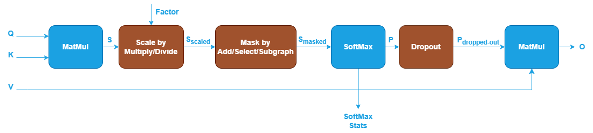
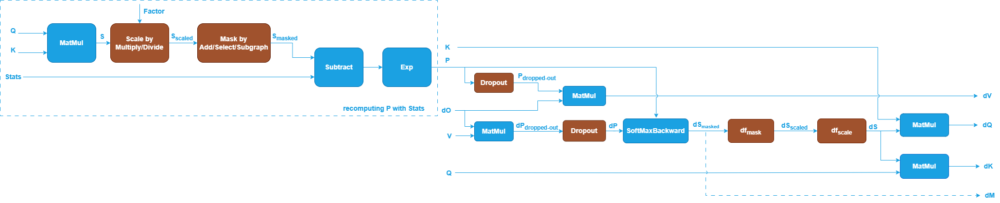
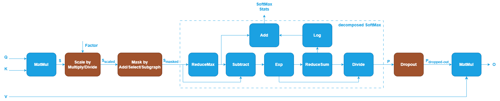
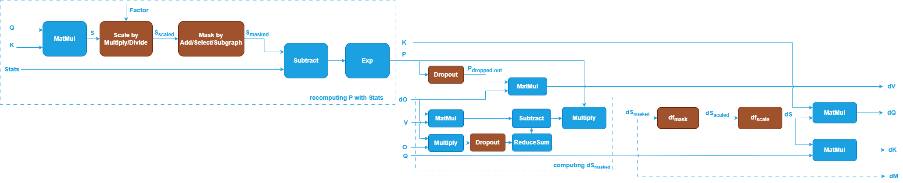

# Revisit SDPA Training Backward

### 1. RFC Catch-up and Current Status
In initial discussions for supporting Scaled Dot-Product Attention (SDPA)
training in the oneDNN Graph API, three proposals were evaluated to handle
Softmax statistics (See [README.md](README.md) for more details):

*   **Proposal 2.A (Rejected):** This approach suggested not saving statistics,
    requiring the storage of the full Softmax output ($P$) or full
    recomputation, which leads to **Out-of-Memory (OOM)** issues or reduced
    efficiency.
*   **Proposal 2.B (Approved):** This proposal suggested **extending the
    existing SoftMax operation** to include an optional stats output
    (logsumexp), used in the backward pass to reconstruct the attention matrix
    $P$.

*   **Proposal 2.C (Rejected):** This suggested decomposing SoftMax into smaller
    pointwise and reduction operations. It was rejected due to graph complexity
    and potential confusion for users.

**Current Status:** The current **reference implementation** follows the
approved Proposal 2.B.

---

### 2. New Discussion

The GPU team is now implementing optimized microkernels for SDPA training. The
forward microkernel works fine with the current forward graph. But for backward
microkernel, it requires **Forward Output ($O$)** as a new input to the backward
graph, which did not exist in the previously delivered backward graph.

Why backward microkernel needs **Forward Output ($O$)**? It uses a different way
(similar to Proposal 2.C) to compute the Softmax gradient, see the appendix of the
original RFC for more details.

*   **Key Mathematical Change:** Instead of relying solely on the gradient of
    $P$ ($dP$), the algorithm utilizes the **forward output $O$** and the
    **output gradient $dO$**.
*   **Core Logic:** It leverages the mathematical identity $\sum (P \odot dP) =
    \sum (O \odot dO)$ to simplify the statistics needed for the gradient
    calculation.
*   **Formula:** The vectorized form for the Softmax gradient is derived as:  
    $$dS = P \odot (dO \cdot V^T - \sum(O \odot dO))$$

---

### 3. Comparative Analysis
Let $N$ be the sequence length and $d$ be the head dimension ($N \gg d$).

#### **A. Current Reference Implementation**

Calculation formula: $dS = P \odot (dP - \text{rowsum}(P \odot dP))$, where $dP = dO \cdot V^T$.

Specific calculation steps and overhead:

1.  **Matrix multiplication**: Compute $dP = dO \cdot V^T$.
    -   Computational cost: $2N^2d$ FLOPs.

2.  **Element-wise multiplication and reduction**: Compute $\text{rowsum}(P \odot dP)$.
    -   Calculation process: Multiply the $N \times N$ matrix $P$ and the $N
        \times N$ matrix $dP$ element-wise, then sum each row.
    -   Computational cost: $2N^2$ FLOPs (all non-matrix multiplication operations).
    -   **Memory bottleneck**: Since the reduction operation depends on the
        entire row of $dP$, during tiling, the complete $dP$ must first be
        written back to HBM, or an $N \times N$ intermediate state must be
        maintained in memory.

3.  **Final element-wise operation**: $dS = P \odot (dP - \text{rowsum})$.
    -   Computational cost: $2N^2$ FLOPs.

#### **B. GPU Microkernel Implementation**

Calculation formula (substituting Appendix formulas): using the identity: $\sum (P \odot dP) = \sum (O \odot dO)$.

$$
dS = P \odot (dO \cdot V^T - \underbrace{\text{rowsum}(O \odot dO)}_{D})
$$

Specific calculation steps and overhead:

1.  **Precompute linear statistic $D$**: $D = \text{rowsum}(O \odot dO)$.
    -   Calculation process: Both $O$ and $dO$ are of size $N \times d$.
    -   Computational cost: $2Nd$ FLOPs.
    -   **Memory advantage**: $D$ is a vector of length $N$, occupying extremely
        small space $O(N)$, which can be computed once and resident in SRAM.

2.  **Matrix multiplication (Matmul)**: Compute $dP = dO \cdot V^T$.
    -   Computational cost: $2N^2d$ FLOPs.

3.  **Fused element-wise operation**: Compute $dS = P \odot (dP - D)$.
    -   Calculation process: In the block-wise loop, read the pre-stored $D_i$
        from SRAM and directly perform subtraction and multiplication on the
        newly computed $dP$ blocks.
    -   Computational cost: $2N^2$ FLOPs.

#### **Summary**

| Item | **A. Current Reference Implementation** | **B. GPU Microkernel Implementation** |
|---|---|---|
| **Core formula** | $dS = P \odot (dP - \text{rowsum}(P \odot dP))$ | $dS = P \odot (dO \cdot V^T - \text{rowsum}(O \odot dO))$ |
| **Required inputs (backward)** | $Q, K, V, Stats, dO$ | $Q, K, V, Stats, O, dO$ |
| **Input sizes** | $Q \in \mathbb{R}^{N \times d},\ K \in \mathbb{R}^{N \times d},\ V \in \mathbb{R}^{N \times d},\ \text{Stats} \in \mathbb{R}^{N},\ dO \in \mathbb{R}^{N \times d}$ | $Q \in \mathbb{R}^{N \times d},\ K \in \mathbb{R}^{N \times d},\ V \in \mathbb{R}^{N \times d},\ \text{Stats} \in \mathbb{R}^{N},\ O \in \mathbb{R}^{N \times d},\ dO \in \mathbb{R}^{N \times d}$ |
| **Total FLOPs (matmul)** | $\mathbf{2N^2d * 5}$ | $\mathbf{2N^2d * 5}$ |
| **Total FLOPs (non-matmul)** | $\mathbf{2N^2d + 4N^2}$ | $\mathbf{2N^2d + 2N^2 + 2Nd}$ |
| **Extra intermediate/scratch memory** | $\mathbf{O(N^2)}$ (e.g., $dP$ materialization / reduction dependency) | $\mathbf{O(N)}$ (store $D$ only) |
| **Additional required tensor** | None | Forward output $O$, size $\mathbf{O(Nd)}$ |

---

### 4. Integration Impact and Trade-offs
*   **Adopting the GPU Implementation:** We need to update our **Graph Patterns**,
    **reference implementation**, and **documentation** to ensure all
    backends remain consistent with this optimized math.
    * **reference implementation**: reimplement to follow the updated backward
      formula and input requirements.
*   **Maintenance:** To avoid the burden of maintaining two separate backward
    patterns, we need to transition to the new pattern. This transition is
    low-risk for current users as no framework has integrated the backward
    pattern yet (although the current pattern was released in
    **v3.11**, only a PyTorch PR has been opened based on it) and avoids the
    complexity of maintaining two separate backward patterns.
*   **Consequences of Rejection:** If rejected, the GPU team would be forced to
    use the standard $P/dP$ logic or recompute $O=PV$, resulting in performance loss.

---

### 5. Project Timeline (ETA)
*   **v3.11.1:** **No**. Due to the effort and urgent schedule.
*   **v3.12:** **Yes**. The new pattern and updated reference
    implementation will be officially introduced as the standard for SDPA
    training. Get rid of the old pattern as early as possible as frameworks are
    referring to this.