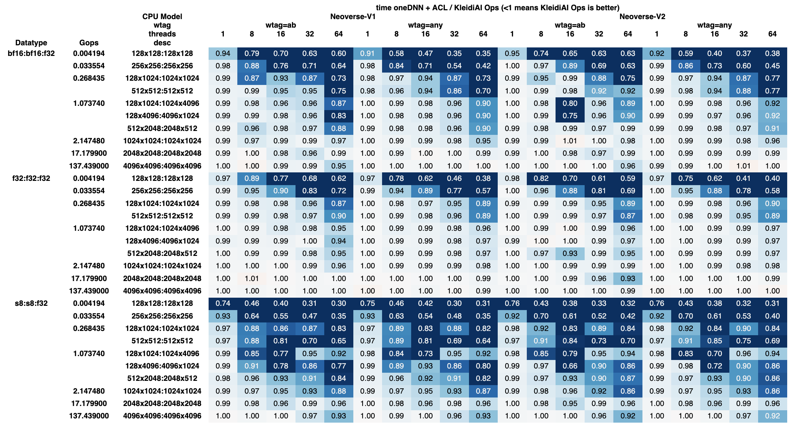

# Simplify the AArch64 Stack by Replacing Compute Library with Arm KleidiAI

## Overview

We propose to simplify the AArch64 stack by replacing Compute Library (ACL) with Arm® KleidiAI™[^1], a smaller and less opinionated library.

This would simplify:
- threading logic
- memory allocation logic
- the build system
- most importantly, the development of new features (e.g. fusion, async runtime)

Replacing ACL with KleidiAI has performance benefits too, particularly for small-moderate problems and large numbers of threads. This primarily comes from reducing instantiation and threading overhead.



The main open question in this RFC is how KleidiAI should be integrated into oneDNN: vendored in-tree, fetched by CMake, or built separately (discussed in detail later). We also welcome feedback or concerns on the rest of this idea too.

[^1]: Specifically [the experimental/ops directory, currently on a feature branch](https://gitlab.arm.com/kleidi/kleidiai/-/tree/feature/add-kleidiai-ops), but will be released as part of KleidiAI. The experimental directory is because the API may change, but the kernels themselves are the same as the ones currently used in oneDNN+ACL so have been well tested.


## Problem

ACL was integrated into oneDNN [around 5 years ago](https://github.com/uxlfoundation/oneDNN/tree/rfcs/rfcs/20200731-Using-Arm-Compute-Library-kernels-on-AArch64), and currently accelerates a large proportion of model runtime. However, the integration is not without problems. The root of most of the problems is that ACL was designed as a framework, so it has state which is incompatible with integration into oneDNN. For example, ACL
- caches reorders
- does its own thread management
- does its own memory management
- requires a separate build step + extra flags

Various clever workarounds have been put in place to avoid some of these issues, but the state is inextricably part of the architecture of ACL. As a result, these workarounds have overhead for development and performance.


## Proposal

Fortunately these workarounds aren't necessary. There is a much lower level GEMM library inside ACL, which we have extracted and intend to release as part of [KleidiAI](https://gitlab.arm.com/kleidi/kleidiai/-/tree/feature/add-kleidiai-ops). KleidiAI is more architecturally suited for integration into oneDNN, and allows us to remove all the complicated workarounds. Also, removing layers of the stack has the added benefit of simpler development and debugging, and reduction of overhead.

This has been demonstrated in a [proof of concept (PoC, currently alpha quality)](https://github.com/uxlfoundation/oneDNN/tree/jondea/replace-acl-with-kleidiai). The `kai_matmul_t` PoC is arguably more straightforward even than the previous `acl_matmul_t` wrapper (and also cuts out all of the layers in ACL). Whereas previously we had:
- `acl_matmul_t` -> `arm_compute::...::CpuGemmAssemblyDispatch` -> `arm_gemm::IGemmCommon`
- `acl_lowp_matmul_t`/`acl_lowp_matmul_sq_t` -> `arm_compute::...::CpuGEMMLowp` -> `arm_compute::...::CpuGemmAssemblyDispatch` -> `arm_gemm::IGemmCommon`
- `acl_inner_product_t` -> `arm_compute::...::CpuFullyConnectedLayer` -> `arm_compute::...::CpuGemmAssemblyDispatch` -> `arm_gemm::IGemmCommon`
- & conv implementations

We will now have:

- `kai_matmul_t` -> `kai::ops::IGemmCommon`
- `matmul_inner_product_t` -> `kai_matmul_t` -> `kai::ops::IGemmCommon`
- & conv implementations

In the process we have also removed the need for the custom scheduler wrapper.

The most important logic is in `kai_matmul_t::execute` (`src/cpu/aarch64/matmul/kai_matmul.cpp`). We can see that in this PoC we avoid storing primitive state by creating a lightweight `kai::ops::IGemmCommon` for every execution. This object exposes single-threaded, non-allocating methods to transform inputs and then perform the matrix multiplication. This allows us to easily use the native oneDNN machinery for thread and memory management.

In contrast, the ACL primitives own a struct with instances of ACL objects in them.
This means that locks are required in execute, complicating asynchronous usage of oneDNN primitives.
Also, the current ACL threading mechanism requires complicated wrappers, which have been a source of many hard to debug framework issues.

We see large performance improvements for smaller problems and higher numbers of threads (see image in overview). For large problems and smaller numbers of threads, the effect is smaller but still positive.

**Ultimately the most important motivation is that it is a much simpler stack and no worse for performance. It is also low risk, because for the most important operations we are using the same code paths, with a several layers of the stack cut out.**


### All Primitive Implementations

Matmul makes up a large proportion of model runtime, but we also need to replace other ACL implementations. Inner product can be implemented as a wrapper around matmul. We discuss the remaining primitives in the table below.


| Primitive  | Data Type    | Adv SIMD impl | SVE impl |
| ---------- | ------------ | ---------- | -------- |
| matmul/ip  | f32/bf16/f16 | KAI ✅     | KAI ✅   |
| matmul/ip  | u8/s8        | KAI ✅     | JIT ✅^1 |
| conv       | f32          | KAI ✅ ^2  | JIT ✅ ^2   |
| conv       | f16          | KAI ✅ ^2  | KAI ✅ ^2  |
| conv       | bf16         | KAI ✅ ^2  | KAI ✅ ^2 |
| conv       | u8/s8        | N/A ^3     | JIT ✅   |
| eltwise    | all          | JIT ✅^4   | JIT ✅   |
| softmax    | all          | JIT ✅^4   | JIT ✅   |
| reorder    | all          | JIT ✅     | JIT ✅   |
| pooling    | all          | JIT ✅     | JIT ✅   |
| binary     | all          | JIT 🟧^5   | JIT ✅   |
| layer norm | all          | JIT 🟧^5   | JIT 🟧^5 |
| batch norm | all          | JIT 🟧^5   | JIT ✅   |
| prelu      | all          | JIT ❌^5   | JIT ❌^5 |

Legend:
- ✅: Already done, either on main or the PoC branch associated with this RFC
- 🟧: Almost finished, will be up for PR soon
- ❌: Not done yet, but will do before ACL is removed
- Adv SIMD: [Advanced SIMD](https://developer.arm.com/documentation/100076/0100/Instruction-Set-Overview/Overview-of-the-Arm-Architecture/Advanced-SIMD)
- SVE: [Scalable Vector Extension](https://developer.arm.com/Architectures/Scalable%20Vector%20Extensions)
- KAI: KleidiAI based implementation, e.g. `kai_matmul_t`
- JIT: JIT in time assembled implementations using Xbyak_aarch64, e.g. `jit_int8_matmul`

Notes:
1. We have two good options: JIT and KleidiAI. We plan to use the existing `jit_int8_matmul_t` for SVE and use KleidiAI to support any gaps (currently Adv SIMD). The rationale is that quantized integer operators come in so many variants that the flexibility that JIT provides is a clear advantage in this case. However, we can reassess this decision later on.
2. We can use KleidiAI with wrappers inspired by ACL, or we can use JIT. JIT is already used for all SVE 256, but ACL is still used over JIT for all Adv SIMD, some SVE 128 F32 and all BF16 (because ACL uses BFMMLA). To reduce risk of regressions, we will replace ACL convolutions mostly like-for-like with KAI. We would like to tidy this up in the future and rationalize our convolution to fewer methods.
3. Not currently implemented, so no regression
4. Only `log` is missing.
5. Should be relatively straightforward.

Note that post op coverage is reduced in the PoC (relative to ACL), but this will be brought up to parity, with either a thread-fused JIT post op kernel or using the existing post ops fallback (see #5101 for related ground work).

## Testing and migration strategy

We will do the transition as gradually as possible and not remove ACL until we are confident we have reached feature and performance parity. We would appreciate reports of any pain points before it goes into main. This will take at least several months if we go ahead.

Roughly ordered, but mostly concurrent, the steps will be:
- Release kleidiai/experimental/ops (currently on a feature branch) (~1 month)
- Remove non-matmul ACL primitives one by one as they reach parity (~2 months)
- Collect and address feedback about the PoC `replace-acl-with-kleidiai` branch (>2 months, we don't want to rush this)
- Agree on an approach to integrate KleidiAI into oneDNN
- Do a release of [Tool-Solutions](https://github.com/ARM-software/Tool-Solutions) with the PoC `replace-acl-with-kleidiai` to try to fix framework integration issues before the branch goes into oneDNN main (~2 months)
- Merge `replace-acl-with-kleidiai` branch into oneDNN when approved (note that we plan to swap one with the other, so there will be no point where both are required) (>2 months)
- Deal with downstream effects of removing ACL on frameworks (de-risked using Tool-Solutions) (>3 months)


## Open Question: How to Integrate into oneDNN?

The biggest open question is: how exactly do we integrate the library into oneDNN?

Some general notes:
- The [PoC branch](https://github.com/uxlfoundation/oneDNN/tree/jondea/replace-acl-with-kleidiai) currently uses a submodule, this is temporary and we will replace it with whatever approach is chosen below.
- We are proposing to only use [the experimental/ops directory, currently on a feature branch](https://gitlab.arm.com/kleidi/kleidiai/-/tree/feature/add-kleidiai-ops).
- The `ops` library is a separate CMake project and compiles to a library called `kleidiai_ops`. It is not header only.
- This is distinct from the `ukernel` KleidiAI library.
- Currently PT only uses the `ukernel` part of the library and oneDNN will only use the `ops` part.
- The experimental directory is because the API may change, but the kernels themselves are the same as the ones currently used in oneDNN+ACL so have been well tested.
  - Initially, while the `ops` library is experimental, we won't make any guarantees about API stability or interoperability between versions. Once it is stable we plan to version it using the root KleidiAI semantic version number.
- All the KleidiAI source we will use is licensed under the same license as oneDNN, Apache-2.0 (some of the testing infrastructure is under BSD-3 but this is not necessary for the oneDNN integration).

### Solution 1: add KleidiAI to third party

Place the KleidiAI source (just the parts we use, which is a subset of the `experimental/ops` directory) in `third_party`, commit it to the oneDNN repo.
We could then build it by default on AArch64.
This is in line with existing third party libraries (e.g. `Xbyak_aarch64`).

#### Pros
- Simple and reliable
- Fully accelerated AArch64 build without the need for extra build flags. The extra build step and flags cause considerable downstream pain (e.g. when building in PyTorch).
- Possible to add an optional CMake flag `KAI_OPS_INSTALL_PATH` to override the version for development

#### Cons 
- Increased repo size for all platforms, ~18% increase
  - oneDNN is 1,080,353 lines and 84MB of source code
  - After stripping out what we don't need, `kleidiai/experimental/ops` is 331,597 lines (mostly inline assembly) and 15MB of source code
- Updates to KleidiAI may be large diffs of inline assembly (although they would be limited to `third_party/kleidiai`)

### Solution 2: cmake FetchContent

If the source file is too large to include in tree, we could retain the benefits of having KleidiAI in the default build by using cmake's `FetchContent`.
I.e. we would add to the cmake files

```cmake
# third_party/CMakeLists.txt
include(FetchContent)

FetchContent_Declare(
  kleidiai
  GIT_REPOSITORY https://github.com/ARM-software/kleidiai
  GIT_TAG 3d7d9c31f35626860d454f9991a7b73821144583 # Use tag here when released
  PATCH_COMMAND # Possibly run command here to remove stuff we don't need
)
add_subdirectory(kleidiai)
```
and
```cmake
# third_party/kleidiai/CMakeLists.txt
message(STATUS "Fetching kleidiai...")
# Override any flags here
FetchContent_MakeAvailable(kleidiai)
```

FetchContent was introduced in CMake 3.11 and the current minimum version in oneDNN is 3.13.

#### Pros
- Updating KleidiAI is just changing a single hash
- Fully accelerated AArch64 build without the need for extra build flags. The extra build step and flags cause considerable downstream pain (e.g. when building in PyTorch).
- Possible to add an optional CMake flag `KAI_OPS_INSTALL_PATH` to override the version for development

#### Cons
- FetchContent not currently used in oneDNN
- FetchContent requires internet connection during configure stage (we could mitigate this by the `KAI_OPS_INSTALL_PATH` override for build systems that prohibit this)

### Solution 3: build separately (not recommended)

Build KleidiAI separately as we do with ACL and provide the build path to oneDNN. 

```sh
(
	git clone https://github.com/ARM-software/kleidiai
	cd kleidiai/experimental/ops
	cmake -B build
	cmake --build build -j$(nproc)
)
cd oneDNN
KAI_OPS_INSTALL_PATH=../../kleidiai/experimental/ops cmake -B build -DONEDNN_AARCH64_USE_KAI_OPS
cmake --build build -j$(nproc)
```

#### Pros
- Similar to what we are doing now, low risk

#### Cons
- All downstream projects have extra build steps and flags (from experience, this is a big con)
- No canonical version of KleidiAI

## Appendix

### Overheads

We have asserted throughout that the extra layers of ACL add performance overheads, but how big are they?
Overall they are not large, but they are measurable by considering a small problem.
For a single threaded matmul we see a runtime overhead of ~0.001ms (=1µs) and for more threads, it becomes larger ~0.007ms (=7µs).
```
        128x128:128x128
        mean runtime / ms
        kai       acl
threads
1       0.050     0.051
2       0.029     0.032
4       0.016     0.019
8       0.011     0.014
16      0.008     0.012
32      0.007     0.014
```

Also the mean primitive construction time goes down by ~40% (0.025ms -> 0.015ms).
